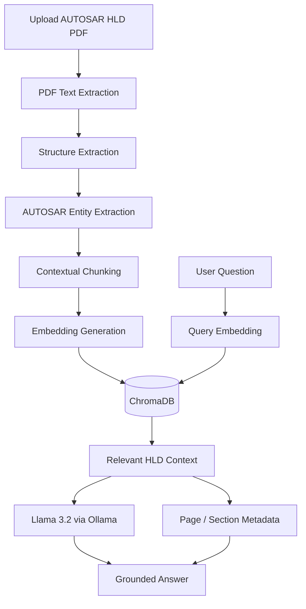
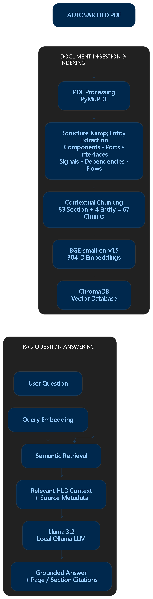
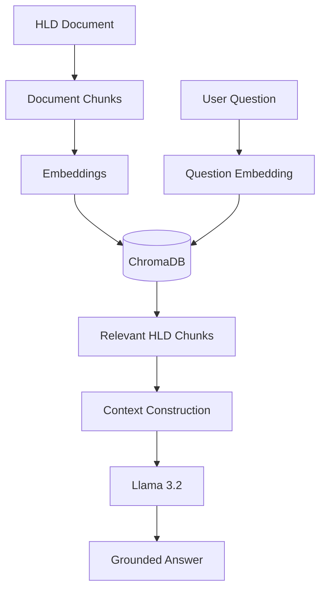

Absolutely. Below is the **complete `README.md` code** ready to copy-paste into your GitHub repository.

````markdown
# AUTOSAR HLD Document Analysis Assistant

> An AI-assisted system for extracting, searching, analyzing, comparing, and validating AUTOSAR High-Level Design (HLD) documents using document processing, semantic search, Retrieval-Augmented Generation (RAG), and a local Large Language Model (LLM).

---

## 📌 Project Overview

AUTOSAR High-Level Design (HLD) documents contain a large amount of architecture information such as:

- Software Components
- Interfaces
- Ports
- Signals
- Dependencies
- Functional Flows
- Component relationships
- Integration information

Manually finding relationships between these elements in large HLD documents can require significant review effort.

The **AUTOSAR HLD Document Analysis Assistant** provides an AI-assisted approach for converting HLD PDF documents into structured and searchable architecture knowledge.

The system allows users to:

- Upload AUTOSAR HLD PDF documents
- Extract text, sections, headings, and document structure
- Identify AUTOSAR architecture entities
- Create contextual document chunks
- Generate semantic embeddings
- Store embeddings in ChromaDB
- Perform semantic retrieval
- Ask natural-language questions about the HLD
- Generate grounded answers using a local Llama 3.2 LLM
- Display page and section-based source citations
- Generate AUTOSAR entity reports
- Compare different HLD versions
- Perform basic architecture validation

---

# 🎯 Problem Statement

AUTOSAR HLD documents can contain hundreds of pages of architecture information.

Important relationships may be distributed across different sections of the document. For example:

```text
EngineControl
      ↓
SpeedDataReceiver R-Port
      ↓
ISpeedData Interface
      ↓
VehicleSpeed Signal
````

Finding this information manually can be time-consuming.

The objective of this project is to provide an AI-assisted system that can extract this architecture knowledge, make it searchable, and answer architecture-related questions using information retrieved from the provided HLD document.

---

# 💡 Proposed Solution

The system follows a Retrieval-Augmented Generation (RAG) architecture.



---

# 🏗️ System Architecture

The following architecture diagram represents the implemented system.



## Architecture Flow

```text
User
 ↓
Streamlit Frontend
 ↓
FastAPI Backend
 ↓
PDF Processing
 ↓
Structure Extraction
 ↓
AUTOSAR Entity Extraction
 ↓
Contextual Chunking
 ↓
BGE Embeddings
 ↓
ChromaDB
 ↓
Semantic Retrieval
 ↓
Relevant HLD Context
 ↓
Llama 3.2 via Ollama
 ↓
Grounded Answer
 ↓
Source Citation
 ↓
User
```

---

# 🔄 End-to-End Workflow

The complete processing pipeline is:

```text
HLD PDF
   ↓
PDF Text / Document Extraction
   ↓
Section & Heading Extraction
   ↓
AUTOSAR Entity Extraction
   ↓
Contextual Chunking
   ↓
Embedding Generation
   ↓
ChromaDB Vector Storage
   ↓
User Question
   ↓
Query Embedding
   ↓
Semantic Retrieval
   ↓
Relevant HLD Context
   ↓
Llama 3.2 through Ollama
   ↓
Grounded Answer
   ↓
Page / Section Citation
```

---

# 🧩 Core Modules

## 1. PDF Ingestion

The system accepts AUTOSAR HLD PDF documents and extracts page-level text using **PyMuPDF**.

The page number is preserved so that retrieved information can later be associated with its original document location.

### Technology

```text
PyMuPDF / Fitz
```

---

## 2. Structure Extraction

The extracted document is organized into:

* Headings
* Sections
* Document content
* Page information
* Document metadata

This provides architecture context before creating chunks.

---

## 3. AUTOSAR Entity Extraction

The system identifies important AUTOSAR entities such as:

```text
Software Components
Interfaces
Ports
Signals
Dependencies
Functional Flows
```

Example:

```text
Software Component:
EngineControl

Port:
SpeedDataReceiver

Port Type:
R-Port

Interface:
ISpeedData

Signal:
VehicleSpeed
```

---

## 4. Relationship-Oriented Context

The system uses document structure, extracted entities, and contextual chunks to support relationship-oriented questions.

Example:

```text
EngineControl
      ↓
SpeedDataReceiver R-Port
      ↓
ISpeedData
      ↓
VehicleSpeed
```

These relationships are primarily supported through the retrieved HLD context.

> The current implementation does not represent every AUTOSAR relationship as a complete knowledge graph.

---

## 5. Chunking

Document content is divided into smaller contextual chunks.

Each chunk can contain metadata such as:

```text
Document ID
Filename
Page Number
Section
Heading
Entity Type
Entity Name
Content
Source
```

Example:

```text
Entity Type:
Port

Entity Name:
SpeedDataReceiver

Page:
4

Content:
SpeedDataReceiver R-Port consumes vehicle speed
information from the ISpeedData interface.
```

### Current Processing Statistics

```text
Section Chunks : 63
Entity Chunks  : 4
Total Chunks   : 67
```

The processed document produced **67 total chunks**.

---

# 🧠 Embedding Generation

The system converts document chunks into numerical vector representations using **Sentence Transformers**.

## Embedding Model

```text
BAAI/bge-small-en-v1.5
```

## Embedding Dimension

```text
384
```

The embeddings allow semantic similarity-based retrieval.

### Embedding Pipeline

```text
Document Chunk
      ↓
Sentence Transformer
      ↓
384-Dimensional Vector
      ↓
ChromaDB
```

---

# 🗄️ Vector Database

The generated embeddings are stored in:

**ChromaDB**

ChromaDB is used for:

* Local vector storage
* Similarity search
* Metadata-based retrieval
* Retrieving relevant HLD chunks

### Vector Storage Flow

```text
HLD Chunk
   ↓
Embedding
   ↓
ChromaDB
   ↓
Similarity Search
   ↓
Relevant Chunks
```

---

# 🤖 Retrieval-Augmented Generation (RAG)

The project uses RAG instead of training the LLM on the HLD document.



---

## Why RAG?

RAG was selected because AUTOSAR HLD information is document-specific and can change between document versions.

Instead of fine-tuning the LLM for every HLD document:

```text
HLD Document
     ↓
Chunking
     ↓
Embeddings
     ↓
Vector Database
     ↓
Retrieve Relevant Context
     ↓
LLM
```

This allows the system to use the latest processed document information at query time.

---

# 🧠 Local LLM

The project uses a local LLM through **Ollama**.

```text
Ollama
   ↓
Llama 3.2
```

The current implementation uses:

```text
Model:
llama3.2:latest
```

The LLM is executed locally through the Ollama API.

```text
Ollama API
http://localhost:11434/api/generate
```

The LLM is not trained or fine-tuned on the HLD document.

Instead, the relevant HLD context retrieved from ChromaDB is provided to the LLM at query time.

---

# 🛡️ RAG Grounding Strategy

The RAG prompt instructs the LLM to:

* Use only the provided HLD context
* Avoid inventing architecture information
* Provide explanatory answers
* Explain relationships when relevant
* Avoid unsupported information
* State when information is not available in the provided HLD context

Conceptually:

```text
User Question
      ↓
Semantic Retrieval
      ↓
Relevant HLD Context
      ↓
Grounded Prompt
      ↓
Llama 3.2
      ↓
Answer
```

---

# 🔎 Example RAG Question

## Question

```text
Which interface does EngineControl use for vehicle speed?
```

## Retrieved Architecture Context

```text
EngineControl
      ↓
SpeedDataReceiver R-Port
      ↓
ISpeedData
      ↓
VehicleSpeed
```

## Expected Answer

```text
EngineControl uses the ISpeedData interface through the
SpeedDataReceiver R-Port to receive VehicleSpeed information.
```

## Source

```text
Demo-HDL.pdf
Page 4
Section: SpeedDataReceiver
```

---

# 📚 Source Citations

The LLM does not generate the source citation itself.

Instead, the application uses metadata associated with the retrieved chunks.

```text
Retrieved Chunk
      ↓
Metadata
      ↓
Filename
Page Number
Section
      ↓
Backend Citation Generation
      ↓
Final Answer + Citation
```

Example:

```text
Demo-HDL.pdf — Page 4 — Section: SpeedDataReceiver
```

This provides traceability from the generated answer back to the source HLD.

---

# 📊 AUTOSAR Entity Reports

The application provides reports for:

* Software Components
* Interfaces
* Ports
* Signals
* Dependencies
* Functional Flows

Example:

```text
Software Components
-------------------
EngineControl
BrakeControl

Interfaces
----------
ISpeedData
IBrakeCommand

Ports
-----
SpeedDataProvider
SpeedDataReceiver
```

---

# 🔁 HLD Version Comparison

The project supports comparison between two processed HLD versions.

The comparison identifies:

```text
Added
Removed
Changed
Unchanged
```

### Comparison Flow

```text
Old HLD
   ↓
Entity Extraction
   ↓
Comparison
   ↑
Entity Extraction
   ↑
New HLD
```

This can help identify architecture changes between document revisions.

---

# ✅ Architecture Validation

The validation module performs basic consistency checks such as:

* Duplicate ports
* Dependencies with undefined targets
* Dependencies with undefined sources
* Ports without associated interfaces
* Interfaces without associated components
* Signals with missing data types

The purpose is to highlight potential architecture inconsistencies for engineering review.

> The validation module is an assistance mechanism and does not automatically approve or modify architecture designs.

---

# 🖥️ Application Screenshots

All screenshots are available in:

```text
docs/screenshots/
```

## 1. Application Dashboard


---

## 2. HLD Document Upload


---

## 3. Document Processing Result


---

## 4. Chunking and Embedding Result


---

## 5. Extracted Entities


---

## 6. RAG Question


---

## 7. Grounded RAG Answer


---

## 8. Source Citation


---

## 9. Validation Result


---

## 10. Document Comparison


---

## 11. API Backend Evidence


---

# 🎥 Project Demonstration

The project documentation directory contains the demonstration media:

```text
docs/videos.mp3
```

> Note: `videos.mp3` is an audio file. The TechPulse submission requirement specifies a 5–10 minute video demonstration, so the actual screen-recorded video should be submitted separately in the official `Video/` submission folder.

The demonstration covers:

1. HLD document upload
2. Document processing
3. Chunking and embeddings
4. AUTOSAR entity extraction
5. RAG question answering
6. Grounded response
7. Source citations
8. Document comparison
9. Architecture validation
10. Evaluation results

---

# 🛠️ Technology Stack

| Technology             | Purpose                            |
| ---------------------- | ---------------------------------- |
| Python                 | Backend and AI pipeline            |
| FastAPI                | REST API backend                   |
| Streamlit              | Web interface                      |
| PyMuPDF                | PDF text extraction                |
| Sentence Transformers  | Text embeddings                    |
| BAAI/bge-small-en-v1.5 | Embedding model                    |
| ChromaDB               | Vector database                    |
| Ollama                 | Local LLM runtime                  |
| Llama 3.2              | Natural-language answer generation |
| Pydantic               | API data validation                |
| Requests               | HTTP communication with Ollama     |
| Git                    | Version control                    |
| GitHub                 | Source code repository             |

---

# 📁 Project Structure

```text
autosar-hld-assistant/
│
├── README.md
├── LICENSE
├── .gitignore
├── requirements.txt
├── .env.example
│
├── backend/
│   ├── app/
│   │   ├── __init__.py
│   │   ├── main.py
│   │   │
│   │   ├── api/
│   │   │   ├── __init__.py
│   │   │   └── document_routes.py
│   │   │
│   │   ├── services/
│   │   │   ├── __init__.py
│   │   │   ├── pdf_service.py
│   │   │   ├── structure_service.py
│   │   │   ├── entity_service.py
│   │   │   ├── chunk_service.py
│   │   │   ├── embedding_service.py
│   │   │   ├── vector_service.py
│   │   │   ├── retrieval_service.py
│   │   │   ├── llm_service.py
│   │   │   ├── rag_service.py
│   │   │   ├── report_service.py
│   │   │   ├── comparison_service.py
│   │   │   └── validation_service.py
│   │   │
│   │   └── schemas/
│   │
│   ├── uploads/
│   └── vector_db/
│
├── frontend/
│   ├── app.py
│   └── requirements.txt
│
├── docs/
│   ├── Architecture.png
│   ├── videos.mp3
│   ├── architecture.md
│   ├── system-flow.md
│   ├── api-documentation.md
│   │
│   └── screenshots/
│       ├── Screenshot1-Application Dashboard.png
│       ├── Screenshot2-HLD Document Upload.png
│       ├── Screenshot3-Document Processing Result.png
│       ├── Screenshot4-Chunking and Embedding Result.png
│       ├── Screenshot5-Extracted Entities.png
│       ├── Screenshot6-RAG Question.png
│       ├── Screenshot7-Grounded RAG Answer.png
│       ├── Screenshot8-Source Citation.png
│       ├── Screenshot9-Validation Result.png
│       ├── Screenshot10-Document Comparison.png
│       └── Screenshot11-API Backend Evidence.png
│
├── sample_data/
│   └── Demo-HDL.pdf
│
└── tests/
```

---

# 🚀 Installation

## Prerequisites

Install:

* Python 3.10+
* Git
* Ollama

Verify Python:

```bash
python --version
```

Verify Git:

```bash
git --version
```

Verify Ollama:

```bash
ollama --version
```

---

# 📦 Backend Setup

Clone the repository:

```bash
git clone <YOUR-GITHUB-REPOSITORY-URL>
```

Move into the project:

```bash
cd autosar-hld-assistant
```

Create a virtual environment:

```bash
python -m venv venv
```

Activate it on Windows:

```powershell
venv\Scripts\activate
```

Install project dependencies:

```bash
pip install -r requirements.txt
```

If backend-specific requirements are used:

```bash
cd backend
pip install -r requirements.txt
```

---

# 🤖 Configure Llama 3.2

The current implementation uses **Llama 3.2** through Ollama.

Check installed models:

```bash
ollama list
```

Pull the model if it is not already installed:

```bash
ollama pull llama3.2
```

Run the model:

```bash
ollama run llama3.2
```

The backend communicates with:

```text
http://localhost:11434/api/generate
```

Model:

```text
llama3.2
```

---

# ▶️ Run Backend

From the `backend` directory:

```bash
uvicorn app.main:app --reload
```

Backend URL:

```text
http://127.0.0.1:8000
```

Swagger API documentation:

```text
http://127.0.0.1:8000/docs
```

---

# 🖥️ Run Frontend

Open another terminal.

```bash
cd frontend
```

Install frontend dependencies:

```bash
pip install -r requirements.txt
```

Start Streamlit:

```bash
streamlit run app.py
```

Open the URL displayed by Streamlit.

---

# 🧪 Example Questions

After uploading an HLD document, example questions include:

```text
Which interface does EngineControl use for vehicle speed?

Which component depends on SpeedSensor?

Which port does EngineControl use?

What signal is carried by ISpeedData?

What is the relationship between SpeedDataProvider and ISpeedData?

Which interface is used for BrakePressure?

What are the dependencies of EngineControl?

Explain the Vehicle Speed Processing functional flow.

Which components consume VehicleSpeed?

What constraints are related to SpeedDataReceiver?
```

---

# 🔌 API Endpoints

| Method | Endpoint                                | Purpose                  |
| ------ | --------------------------------------- | ------------------------ |
| POST   | `/api/documents/upload`                 | Upload and process HLD   |
| GET    | `/api/documents/report`                 | Generate entity report   |
| GET    | `/api/documents/components`             | Get software components  |
| GET    | `/api/documents/interfaces`             | Get interfaces           |
| GET    | `/api/documents/ports`                  | Get ports                |
| GET    | `/api/documents/signals`                | Get signals              |
| GET    | `/api/documents/dependencies`           | Get dependencies         |
| GET    | `/api/documents/functional-flows`       | Get functional flows     |
| POST   | `/api/documents/retrieve`               | Retrieve relevant chunks |
| POST   | `/api/documents/ask`                    | Ask RAG question         |
| POST   | `/api/documents/compare`                | Compare HLD versions     |
| GET    | `/api/documents/validate/{document_id}` | Validate architecture    |

---

# 📈 Evaluation

A manually prepared evaluation set containing **10 AUTOSAR HLD questions** was used.

The questions covered:

* Interfaces
* Ports
* Signals
* Dependencies
* Component relationships
* Functional flows
* Architecture constraints

## Evaluation Result

```text
Total Questions : 10
Passed          : 10
Failed          : 0

Observed Answer Relevance/Faithfulness:
10/10 = 100%
```

### Evaluation Questions

| #  | Test Area                                          | Result |
| -- | -------------------------------------------------- | ------ |
| 1  | EngineControl interface for vehicle speed          | Pass   |
| 2  | Port receiving VehicleSpeed                        | Pass   |
| 3  | Signal carried by ISpeedData                       | Pass   |
| 4  | Component depending on SpeedSensor                 | Pass   |
| 5  | SpeedDataProvider and ISpeedData relationship      | Pass   |
| 6  | Components consuming VehicleSpeed                  | Pass   |
| 7  | Interface carrying BrakePressure                   | Pass   |
| 8  | Vehicle Speed Processing functional flow           | Pass   |
| 9  | SpeedSensor to EngineControl dependency chain      | Pass   |
| 10 | SpeedDataReceiver-related architecture constraints | Pass   |

> The 100% result represents performance on the selected evaluation set and is not a general accuracy guarantee. Retrieval hit rate, citation accuracy, and systematic latency were not independently quantified.

---

# 🔐 Security and Governance Considerations

The prototype is designed around an evidence-based analysis approach.

Important principles include:

* HLD information should come from approved project documents.
* Answers should be grounded in retrieved document context.
* Source metadata should be preserved for traceability.
* AI output should be reviewed by authorized engineering specialists.
* The system should not automatically approve architecture designs.
* The system should not modify the original HLD document.

For production deployment, additional controls such as:

* Authentication
* Role-Based Access Control
* Project isolation
* Audit logging
* Document version management
* Secure enterprise deployment

should be implemented.

---

# ⚠️ Current Limitations

This project is currently a prototype/MVP.

Current limitations include:

1. PDF extraction quality depends on the structure of the input document.
2. Scanned PDFs require OCR support.
3. Entity extraction currently uses document-pattern-based processing.
4. The vector database is currently local.
5. Some document metadata is maintained in application memory.
6. Retrieval quality depends on the quality of extracted and embedded chunks.
7. LLM answers depend on the retrieved HLD context.
8. Production-level authentication and enterprise access control are not fully implemented.
9. The current implementation does not represent every AUTOSAR relationship as a complete knowledge graph.
10. Validation provides basic consistency checks and should not be treated as formal AUTOSAR architecture certification.
11. The current prototype is intended for document-analysis assistance and engineering review support rather than autonomous architecture approval.

---

# 🔮 Future Scope

Possible improvements include:

* OCR support for scanned HLD documents
* Advanced AUTOSAR relationship extraction
* Architecture knowledge graph visualization
* PostgreSQL-based document metadata storage
* Role-Based Access Control
* Project-level document isolation
* Audit logging
* Advanced HLD revision impact analysis
* Improved table understanding
* Enterprise/on-premise deployment
* Advanced architecture inconsistency detection
* Improved document version management
* Production-grade monitoring
* Automated evaluation pipelines
* Larger domain-specific evaluation datasets
* Structured AUTOSAR knowledge graph construction

---

# 📊 Evaluation Areas

The system can be evaluated using:

## Document Processing

* PDF extraction quality
* Section extraction accuracy
* Table extraction quality

## Entity Extraction

* Component extraction
* Interface extraction
* Port extraction
* Signal extraction
* Dependency extraction

## Retrieval

* Relevance of retrieved chunks
* Top-K retrieval quality
* Metadata filtering

## RAG

* Answer groundedness
* Answer completeness
* Citation validity
* Unsupported-answer detection

## Architecture Analysis

* Entity relationship identification
* Version comparison
* Validation issue detection

---

# 🎓 Project Outcome

The prototype demonstrates an end-to-end AI-assisted workflow for AUTOSAR HLD analysis:

```text
Document Ingestion
        ↓
Architecture Information Extraction
        ↓
Contextual Chunking
        ↓
Semantic Embedding
        ↓
Vector Search
        ↓
Context Retrieval
        ↓
Local LLM Generation
        ↓
Grounded Architecture Answer
        ↓
Source Traceability
```

The system demonstrates how Retrieval-Augmented Generation can be applied to engineering documentation while maintaining traceability to the source document.

---

# ⭐ Key Technical Highlights

* End-to-end RAG pipeline
* Local LLM inference using Ollama
* Llama 3.2 integration
* BAAI/bge-small-en-v1.5 embeddings
* 384-dimensional semantic embeddings
* ChromaDB vector database
* PDF document processing with PyMuPDF
* AUTOSAR-oriented entity extraction
* Contextual document chunking
* Semantic retrieval
* Grounded question answering
* Metadata-based source citations
* HLD version comparison
* Architecture validation
* FastAPI REST backend
* Streamlit user interface
* Local/offline-oriented AI processing

---

# 💭 Why This Project?

Traditional document search mainly depends on exact keyword matching.

For engineering documents, users often ask relationship-based questions such as:

```text
Which port does EngineControl use
to receive VehicleSpeed?
```

The required information may be distributed across multiple sections.

The RAG approach allows the system to:

```text
Understand the question
        ↓
Find semantically relevant content
        ↓
Combine relevant HLD context
        ↓
Generate an explanatory answer
        ↓
Show source information
```

This makes the system more useful for architecture-document analysis than simple keyword search.

---

# 🏢 Intended Use

The prototype can support engineering teams in activities such as:

* HLD document exploration
* Architecture information lookup
* Component dependency analysis
* Interface and port analysis
* Signal tracing
* Functional flow understanding
* HLD revision comparison
* Preliminary architecture consistency checks

The system is intended as an **engineering assistance tool** and not as a replacement for expert architecture review.

---

# 👨‍💻 Author

**Khushalsing Pawar**

B.Tech Information Technology

GitHub: `https://github.com/KhushalsingPawar`

LinkedIn: `https://www.linkedin.com/in/khushalsing-pawar/`

---

# 📄 License

This project is developed as an academic/industry case-study prototype.

Add an appropriate open-source license if the project is intended to be publicly distributed.

````

### Important before you paste it

Your repository should match these names **exactly**, including spaces:

```text
docs/
│
├── Architecture.png
├── Video.mp4
│
└── screenshots/
    ├── Screenshot1-Application Dashboard.png
    ├── Screenshot2-HLD Document Upload.png
    ├── Screenshot3-Document Processing Result.png
    ├── Screenshot4-Chunking and Embedding Result.png
    ├── Screenshot5-Extracted Entities.png
    ├── Screenshot6-RAG Question.png
    ├── Screenshot7-Grounded RAG Answer.png
    ├── Screenshot8-Source Citation.png
    ├── Screenshot9-Validation Result.png
    ├── Screenshot10-Document Comparison.png
    └── Screenshot11-API Backend Evidence.png
````

